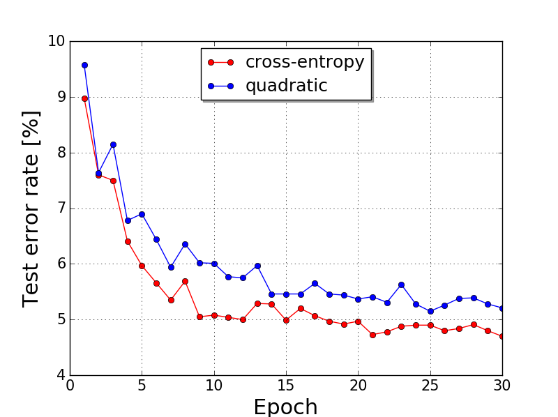
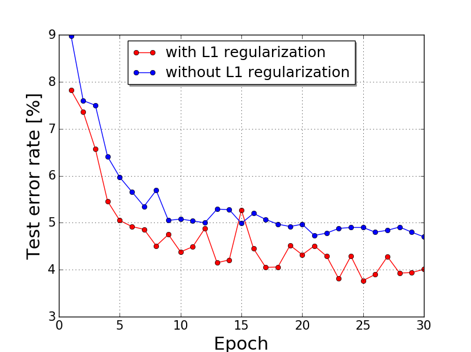
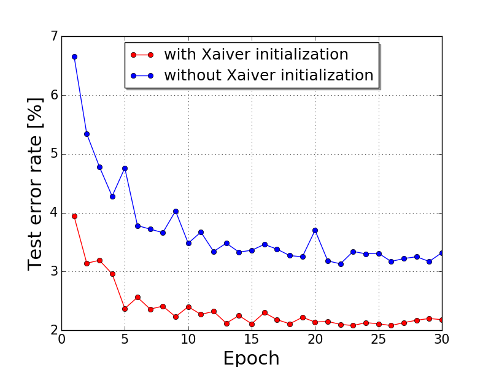
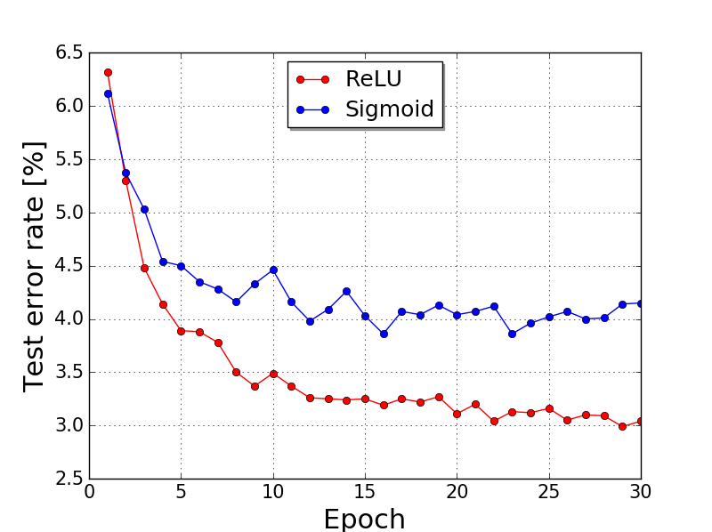

# numpy-neuralnet-exercise

All codes and slides are based on the online book [neuralnetworkanddeeplearning.com](http://neuralnetworksanddeeplearning.com/).

## numpy-only-implementation
From example1.py to example8.py is implemented via only numpy and use the same architecture of a simple network called multilayer perceptrons (MLP) with one hidden layer.  

#### example1.py : Quadratic Loss, SGD, Sigmoid (BASE LINE)
n is the number of unit in a hidden layer in following results.
#### example2.py : BASE LINE + Cross Entropy Loss
*n=30* | *n=100*
:---: | :---: |
 |  |  
#### example3.py : BASE LINE + Cross Entropy Loss + L2 regularization
*n=30* | *n=100*
:---: | :---: |
 |  |  
#### example4.py : BASE LINE + Cross Entropy Loss + L1 regularization
*n=30* | *n=100*
:---: | :---: |
 |  |  
#### example5.py : BASE LINE + Cross Entropy Loss + Droput
*n=30* | *n=100*
:---: | :---: |
 |  |  
#### example6.py : BASE LINE + Cross Entropy Loss + Xavier Initializer
*n=30* | *n=100*
:---: | :---: |
 |  |  
#### example7.py : BASE LINE + Cross Entropy Loss + Momentum based SGD
*n=30* | *n=100*
:---: | :---: |
 |  |  
#### example8.py : BASE LINE + Cross Entropy Loss + Xavier Initializer + ReLU
*n=30* | *n=100*
:---: | :---: |
 |  |  

## lauchers for other resources of numpy-only-implementation  
There are also good resources for numpy-only-implementation and laucher for each recourse is provided.

*Resource* | *Launcher*
:---: | :---: |
[neuralnetworkanddeeplearning.com](https://github.com/mnielsen/neural-networks-and-deep-learning) | [launcher_package1.py](https://github.com/hwalsuklee/numpy-neuralnet-exercise/blob/master/launcher_package1.py) |   
[Stanford CS231 lectures](https://github.com/cthorey/CS231/tree/master/assignment2) | [launcher_package2.py](https://github.com/hwalsuklee/numpy-neuralnet-exercise/blob/master/launcher_package2.py) |  

## simple tensoflow code for CNN
Code in tf_code_mnist folder is for CNN implmentation.  
[ch6_summary.pdf](https://github.com/hwalsuklee/numpy-neuralnet-exercise/blob/master/slides/ch6_summary.pdf) is related slide.

*Command* | *Description* | *MNIST acc.*  
:--- | :--- | :--- |
`train --model v0` | model v0 : BASE LINE + Softmax Layer + Cross Entropy Loss  | 97.80%
`train --model v1` | model v1 : model v0 + 1 Convolutional/Pooling Layers  | 98.78%
`train --model v2` | model v2 : model v1 + 1 Convolutional/Pooling Layers  | 99.06%  
`train --model v3` | model v3 : model v2 + ReLU  | 99.23%  
`train --model v4` | model v4 : model v3 + Data Augmentation | 99.37%   
`train --model v5` | model v5 : model v4 + 1 Fully-Connected Layer  | 99.43% |  
`train --model v6` | model v6 : model v5 + Dropout  | 99.60% |  
